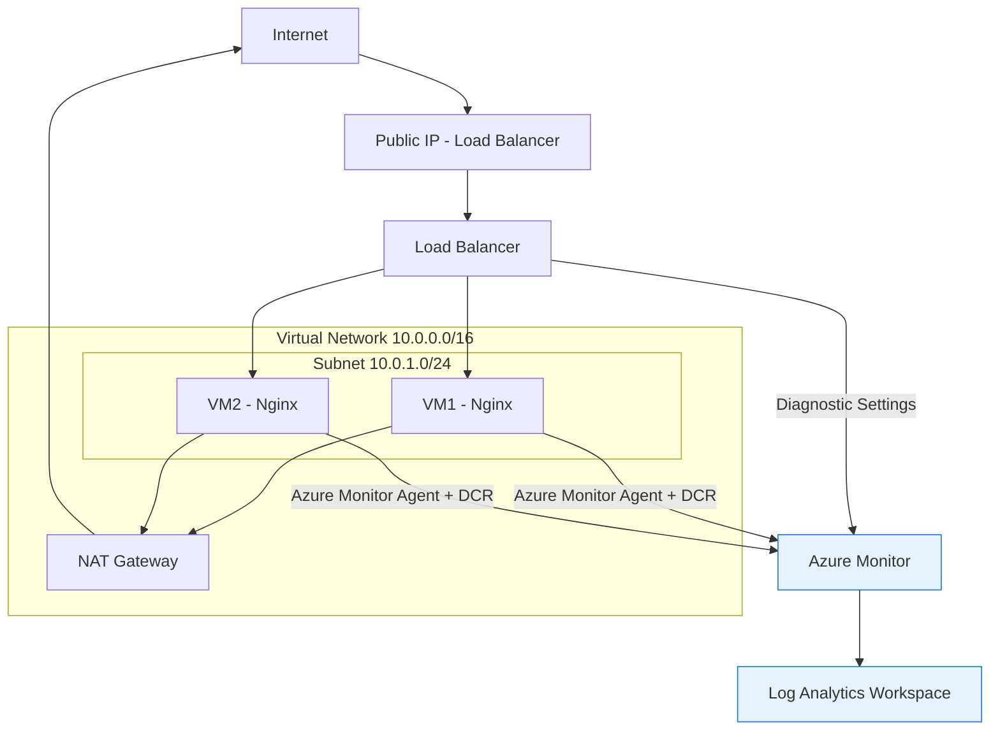
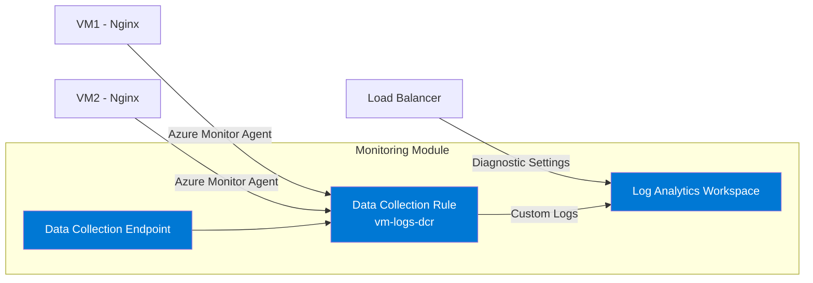

# Azure Infrastructure with Terraform


**Author:** Hiramatsu, María Jose  
**Role:** Cloud Engineer / DevOps Engineer  
**Creation Date:** April 2026  
**Version:** 1.0.0  


This project deploys a basic infrastructure in Azure using **Terraform** as an Infrastructure as Code (IaC) tool.  
The architecture includes a Load Balancer, 2 virtual machines, and a centralized monitoring system.  


## Demo Video
[Watch the presentation](https://www.youtube.com/watch?v=4w74aq6S5WI)


## General Architecture

The infrastructure includes:  

- Virtual Network (VNet) + private Subnet  
- 2 Virtual Machines (Ubuntu + Nginx)  
- Public Load Balancer (Standard SKU)  
- Network Security Group (NSG)  
- NAT Gateway (internet outbound access)  
- Log Analytics Workspace  
- Azure Monitor Agent + Data Collection Rules (DCR)  
- Data Collection Endpoint  


### Architecture Diagram





## Project Structure
```bash
.
├── main.tf
├── variables.tf
├── outputs.tf
├── terraform.tfvars
├── modules/
│   ├── networking/
│   ├── virtualmachines/ # VMs + Azure Monitor Agent + DCR + DCE
│   ├── loadbalancer/
│   └── monitoring/
```


### Project Root (`/`)

The root folder contains the main files.  
Here, the Azure and Azapi providers are defined. These are needed to connect the Nginx servers.  
From this level, all modules are called.  


### Modules

The infrastructure is organized into 4 reusable modules:  

#### 1. Networking (`modules/networking`)


This module creates the virtual network and required subnets.  


- Creates a **Virtual Network (VNet)**  
- Creates a **Subnet** where the virtual machines will run  
- Configures address space and basic network rules  


#### 2. Load Balancer (`modules/load-balancer`)


This module deploys and configures the load balancer.  


- Azure Standard Load Balancer  
- Load balancing rules with **Default** strategy (equal distribution based on requests)  
- Health probes to check VM status  
- Public frontend IP to expose the application  


#### 3. Virtual Machines (`modules/virtual-machines`)


This module is responsible for deploying the virtual machines.  


- Creates the Virtual Machines  
- Connects them to the subnet from the networking module  
- Configures internet outbound access (NAT Gateway or default route)  
- Installs monitoring extensions  
- Sends logs to Azure Monitor  
- Two Ubuntu servers with Nginx pre-installed  


#### 4. Monitoring (`modules/monitoring`)


This is the most important module from a technical perspective because it handles **observability** across the entire infrastructure.  

**Azure Monitoring Architecture:**  

  


This module implements a centralized monitoring solution using:  


- **Azure Monitor** as the main platform   
- **Data Collection Rules (DCR)** to collect logs and metrics efficiently  
- **Log Analytics Workspace** as the central log storage  
- Diagnostics enabled on Load Balancer and Virtual Machines  


**Important feature:**  
The **Monitoring module** is transversal to the whole infrastructure. This means it applies to all resources (Load Balancer and Virtual Machines), independent of their module.  
It provides a unified view of health, performance, and logs in one place.  


---


### How to Deploy

## Requirements

* Terraform >= 1.x  
* Azure account  
* Authenticated Azure CLI:  


```bash
az login
```


## Deployment Steps


### 1. Initialize

```bash
terraform init
```


### 2. Validate

```bash
terraform validate
```


### 3. Format code

```bash
terraform fmt -recursive
```


### 4. Plan

```bash
terraform plan
```


### 5. Apply

```bash
terraform apply
```


## Access


After deployment:  


```bash
terraform output lb_public_ip
```


In your terminal:  


```
for i in {1..100}; do curl http://<public_ip_lb>; done
```


## Cleanup


To delete all resources:  

```bash
terraform destroy
```

---


## Dashboards and Queries
[see dashboard](documentation/dashboard_2.pdf)  
You can create dashboards with KQL queries that monitor resources every 5 minutes.  
In Azure Monitor, you can create queries to visualize:  


- Requests per minute in the Load Balancer  
- Traffic distribution between VMs  
- Most frequent IPs  
- Virtual machine health status  
- Load balancing rule usage  


## Nginx - Web Traffic
### Requests per minute per VM
```
NginxLogs_CL
| where FilePath contains "access.log"
| summarize TotalRequests = count() 
    by Computer, bin(TimeGenerated, 1m)
| render timechart 
    (with title="Requests per minuto per VM")
```


## HTTP Status Code Distribution
```
NginxLogs_CL
| where FilePath contains "access.log"
| extend StatusCode = extract(@" (\d{3}) ", 1, RawData)
| summarize Count = count() by StatusCode
| render barchart 
    (with title="HTTP Status Code Distribution")
```


## Top 10 IPs with Highest Traffic
```
NginxLogs_CL
| where FilePath contains "access.log"
| extend ClientIP = extract(@"(\d+\.\d+\.\d+\.\d+)", 1, RawData)
| summarize Requests = count() by ClientIP
| top 10 by Requests desc
| render barchart 
    with (title="Top 10 IPs with Highest Traffic")
```


## Errors and Health
### Errors 4xx y 5xx
```
NginxLogs_CL
| where FilePath contains "access.log"
| extend StatusCode = extract(@" (\d{3}) ", 1, RawData)
| where StatusCode >= "400"
| summarize Errors = count() by StatusCode, bin(TimeGenerated, 1m)
| render timechart 
    with (title="Errors and Health")
```

## VM Heartbeat
```
Heartbeat
| summarize LastSeen = max(TimeGenerated) by Computer
| extend Status = iff(datetime_diff('minute', now(), LastSeen) < 5, "v Healthy", "x Unhealthy")
with (title="Heartbeat")
```

## Traffic Over Time
```
AzureDiagnostics
| where Category == "NetworkSecurityGroupEvent"
| summarize count() by bin(TimeGenerated, 5m)
| sort by TimeGenerated asc
```


## Traffic by Type: Allow vs Deny
```
AzureDiagnostics
| where Category == "NetworkSecurityGroupEvent"
| summarize count() by action_s, bin(TimeGenerated, 5m)
| render timechart
with (title="Allow vs Deny")
```


## Most Used Rules
```
AzureDiagnostics
| where Category == "NetworkSecurityGroupRuleCounter"
| summarize hits = sum(counter_s) by ruleName_s
| top 10 by hits desc
| render barchart
with (title="Most Used Rules")
```


## Traffic by IP
```
AzureDiagnostics
| where Category == "NetworkSecurityGroupEvent"
| summarize count() by src_ip_s
| top 10 by count_ desc
| render piechart
with (title="Traffic by IP")
```


## Traffic to the VMs
```
AzureDiagnostics
| where Category == "NetworkSecurityGroupEvent"
| summarize count() by dest_ip_s
| render barchart
with (title="Traffic to the VMs")
```


## Important Notes


* The deployment generates costs in Azure (especially NAT Gateway and Standard Load Balancer)  
* Monitoring with Log Analytics also has cost depending on data volume  
* Nginx logs may take 5 to 15 minutes to appear for the first time  
  


---

## Author

Project developed as a practice for Azure infrastructure with Terraform — and also for fun.  


---


## Future Improvements


* Implement HTTPS with Application Gateway + WAF  
* Auto Scaling with Virtual Machine Scale Sets  
* Proactive alerts in Azure Monitor  
* Grafana integration  
* Private Link for Log Analytics  
* Infrastructure as Code with GitHub Actions  


---


### Project developed as an advanced practice of Terraform + Azure + Observability